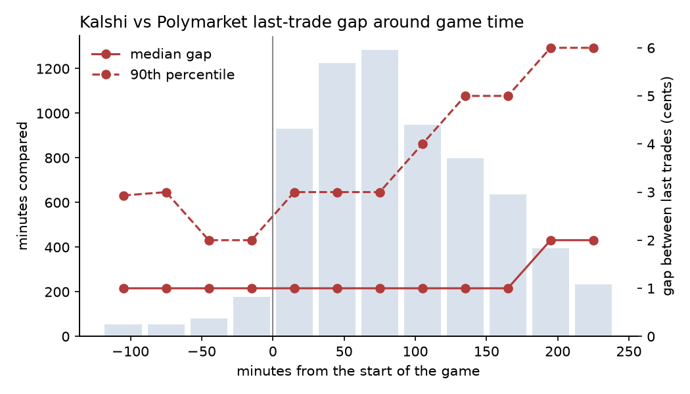

# Kalshi × Polymarket cross-venue monitor, built on the Kairos API

A daily look at how Kalshi and Polymarket price the same events, using [Kairos](https://kairos.trade)'s matched-market catalog to find them. Maintained by [Prediction@Illinois](https://prediction-illinois.github.io).

<!-- report:start -->
**Latest report: [2026-10-07](reports/latest.md)**

| | |
|---|---|
| Kalshi–Polymarket pairs lined up | 2,236 of 2,278 |
| Edge after fees, after the order books | 2 of 2,236 pairs |
| Median last-trade gap, games 6–30 h ago | 1¢ over 6,814 minutes |
| Settled the same way, last 7 days | 262 of 262 |


<!-- report:end -->

## What it measures

| Part | Question | Data |
|---|---|---|
| Pairs | Which Kalshi and Polymarket markets are the same event, and which Polymarket outcome pays when Kalshi YES pays? | Kairos `/matched-markets`, checked on both venues by [oracle3-extras](https://github.com/YichengYang-Ethan/oracle3-extras) |
| Gaps today | Do any prices break P(A) = P(B) after both venues' fees, and for how many contracts? | Kalshi and Polymarket public quotes and order books, each venue's fee schedule |
| Gaps around game time | How far apart do the two venues trade before and during a game? | Kairos one-minute candles |
| Settlement | Did both venues pay out the same way? | Kairos `/v1/resolutions` |

Each day's numbers are in [`reports/`](reports/); [`reports/latest.md`](reports/latest.md) is the newest, and [`reports/data/`](reports/data/) holds the same numbers as JSON.

## How it works

```text
Kairos Data API            oracle3-extras                         this repository
/matched-markets   --->    line up outcomes, check both venues --->  every 6 hours: archive the pairs
                           scan after fees, walk order books         daily at 12:00 UTC: report
Kairos Market Data API --> price history, settlement checks           reports/, README
```

[`.github/workflows/monitor.yml`](.github/workflows/monitor.yml) runs every six hours. Each run adds the current pairs to an archive, because Kairos drops a pair from its catalog once the markets expire. The 12:00 UTC run also builds the report with [`report.py`](report.py) and commits it.

## Run it yourself

```bash
pip install -r requirements.txt
oracle3-extras kairos snapshot --archive archive/pairs.jsonl.gz   # a few times a day
python report.py --archive archive/pairs.jsonl.gz --out reports
```

No account is needed. A Kairos API key raises the rate limits: set `KAIROS_CLIENT_ID`, `KAIROS_API_KEY` and `KAIROS_API_SECRET` (a read-only key is enough; nothing here trades). In GitHub Actions, add them as repository secrets.

## Reading the numbers

- **Gaps today** count pairs whose prices break the bound after fees on both legs. Most gaps at the top of the book disappear after fees or in the order books.
- **Gaps around game time** compare the last trades on each venue in the same minute. They show the venues disagreeing, not an arbitrage that could have been executed: two trades in one minute can be up to a minute apart, and in-play prices move fast.
- **Settlement** compares how each venue paid out. A disagreement means the two contracts were not the same bet after all, which is the main risk in cross-venue trading.

## Data and attribution

Data: Kairos Data API and Market Data API; Kalshi and Polymarket public APIs. This repository publishes aggregate statistics, charts and a few example rows; the archive of pairs stays in the workflow cache. Kairos, Kalshi and Polymarket are trademarks of their owners; this project is not affiliated with or endorsed by them.

## License

Apache 2.0; see [LICENSE](LICENSE).
