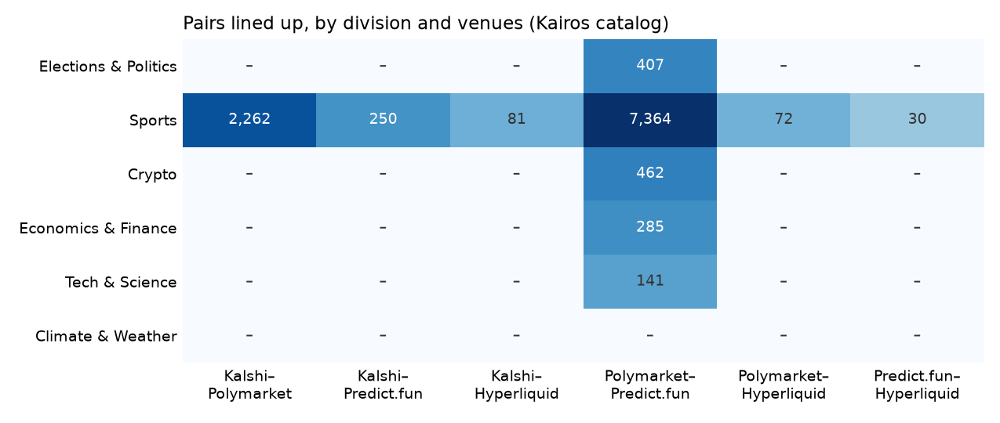
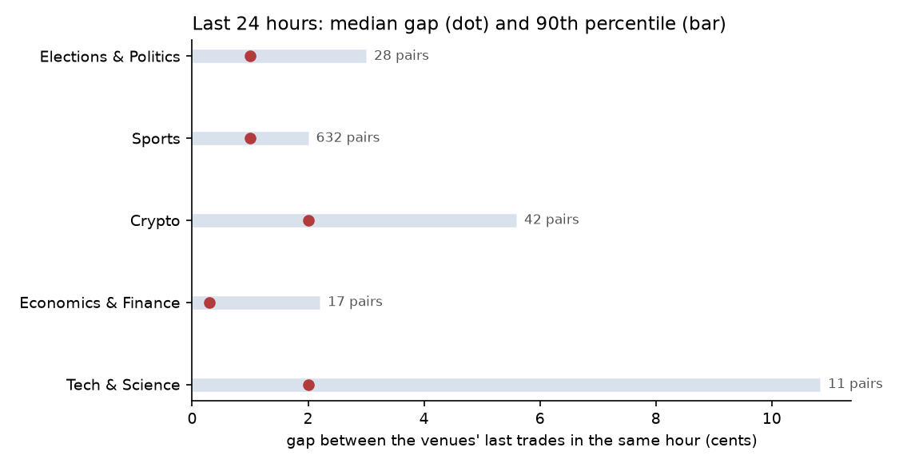

# Kairos cross-venue report, 2026-10-07

Generated 2026-10-07 20:46 UTC from Kairos's matched-market catalog, Market Data API and fee quotes, and Kalshi and Polymarket order books. Pairs are grouped into [Prediction@Illinois](https://prediction-illinois.github.io)'s six market divisions by Kairos's own categories.

## Overview

| Division | Pairs Kairos lists | Lined up | Edge after fees, confirmed | Median gap, last 24 h | Settled the same way, last 7 days |
|---|---|---|---|---|---|
| Elections & Politics | 407 | 407 | 2 of 193 | 1.0¢ (28 pairs) | – |
| Sports | 10,145 | 10,059 | 3 of 3,758 | 1.0¢ (632 pairs) | – |
| Crypto | 462 | 462 | 0 of 270 | 2.0¢ (42 pairs) | – |
| Economics & Finance | 285 | 285 | 0 of 156 | 0.3¢ (17 pairs) | – |
| Tech & Science | 141 | 141 | 0 of 51 | 2.0¢ (11 pairs) | – |
| Climate & Weather | 0 | 0 | – | – | – |

Another 24 pairs fall outside the six divisions (Culture 24).

## Pairs

Kairos listed 11,464 matched pairs across 6 venue combinations; oracle3-extras lined up the outcomes of 11,378 (99%), 77 of them with a warning such as a postponed game.

| Division | Venues | Lined up |
|---|---|---|
| Elections & Politics | Polymarket–Predict.fun | 407 of 407 |
| Sports | Polymarket–Predict.fun | 7,364 of 7,415 |
| Sports | Kalshi–Polymarket | 2,262 of 2,294 |
| Sports | Kalshi–Predict.fun | 250 of 252 |
| Sports | Kalshi–Hyperliquid | 81 of 81 |
| Sports | Polymarket–Hyperliquid | 72 of 72 |
| Sports | Predict.fun–Hyperliquid | 30 of 31 |
| Crypto | Polymarket–Predict.fun | 462 of 462 |
| Economics & Finance | Polymarket–Predict.fun | 285 of 285 |
| Tech & Science | Polymarket–Predict.fun | 141 of 141 |
| Other | Polymarket–Predict.fun | 24 of 24 |

| Not lined up | Pairs |
|---|---|
| different events | 51 |
| different dates | 28 |
| could not confirm both markets ask about the same team | 5 |
| could not tell which outcome is the Kalshi YES outcome | 1 |
| could not line up the outcomes | 1 |

## Live check

Each pair is priced on both venues and checked for a basket that pays more than it costs after both venues' fees. Kalshi and Polymarket have public order books, so their edges are walked down the books. Predict.fun is priced from its last trades, which can be weeks old; the largest of those edges are confirmed with Kairos fee quotes, which walk the live Predict.fun book.

| Division | Priced on live books | Edge after fees | Left after the books | Priced from last trades | Edge on last trades | Checked with fee quotes | Confirmed |
|---|---|---|---|---|---|---|---|
| Elections & Politics | 0 | 0 | 0 | 193 | 131 | 11 | 2 |
| Sports | 2,262 | 10 | 3 | 1,496 | 751 | 24 | 0 |
| Crypto | 0 | 0 | 0 | 270 | 158 | 6 | 0 |
| Economics & Finance | 0 | 0 | 0 | 156 | 109 | 4 | 0 |
| Tech & Science | 0 | 0 | 0 | 51 | 40 | 4 | 0 |
| Other | 0 | 0 | 0 | 21 | 14 | 1 | 0 |

Not priced: no Predict.fun trades yet 6,746; no live quotes for Hyperliquid yet 183.

| Division | Venues | Market A | Market B | Basket | Contracts | Net edge | Checked with |
|---|---|---|---|---|---|---|---|
| Elections & Politics | Polymarket–Predict.fun | Will John Fetterman win the 2028 Democratic presidential nomination? | Will John Fetterman win the 2028 Democratic presidential nomination? | YES on A + NO on B | 250.0 | $0.2300 | Kairos fee quotes |
| Elections & Politics | Polymarket–Predict.fun | Will Oprah Winfrey win the 2028 Democratic presidential nomination? | Will Oprah Winfrey win the 2028 Democratic presidential nomination? | YES on A + NO on B | 250.0 | $0.2300 | Kairos fee quotes |
| Sports | Kalshi–Polymarket | Indiana wins | Pacers vs. Thunder | NO on A + YES on B | 0.74 | $0.0075 | order books |
| Sports | Kalshi–Polymarket | Olga Danilova wins | W35 Wagga Wagga: Olga Danilova vs Naho Sato | NO on A + YES on B | 8.14 | $0.0047 | order books |
| Sports | Kalshi–Polymarket | Yiru Chen wins | W15 Maanshan: Yiru Chen vs Anna Yang | NO on A + YES on B | 0.57 | $0.0018 | order books |

Most edges at the top of the book disappear after fees, in the order books, or once a stale last trade meets the live book.

## Price agreement, last 24 hours

For every pair, both venues' last trades in each hour of the last 24 hours, up to the event's start (a game under way is compared on its pre-game prices only).

| Division | Pairs compared | Hours compared | Median gap | 90th percentile | Hours 2¢ or more apart |
|---|---|---|---|---|---|
| Elections & Politics | 28 | 59 | 1.0¢ | 3.0¢ | 19% |
| Sports | 632 | 2,648 | 1.0¢ | 2.0¢ | 16% |
| Crypto | 42 | 84 | 2.0¢ | 5.6¢ | 60% |
| Economics & Finance | 17 | 68 | 0.3¢ | 2.2¢ | 13% |
| Tech & Science | 11 | 21 | 2.0¢ | 11¢ | 57% |
| Other | 6 | 14 | 0.4¢ | 4.0¢ | 21% |

| Division | Venues | Pairs compared | Median gap | 90th percentile |
|---|---|---|---|---|
| Elections & Politics | Polymarket–Predict.fun | 28 | 1.0¢ | 3.0¢ |
| Sports | Kalshi–Polymarket | 329 | 1.0¢ | 2.0¢ |
| Sports | Kalshi–Predict.fun | 43 | 1.0¢ | 2.0¢ |
| Sports | Polymarket–Predict.fun | 260 | 1.0¢ | 2.0¢ |
| Crypto | Polymarket–Predict.fun | 42 | 2.0¢ | 5.6¢ |
| Economics & Finance | Polymarket–Predict.fun | 17 | 0.3¢ | 2.2¢ |
| Tech & Science | Polymarket–Predict.fun | 11 | 2.0¢ | 11¢ |
| Other | Polymarket–Predict.fun | 6 | 0.4¢ | 4.0¢ |

| Most persistent gaps (at least 3 hours compared) | Division | Venues | Median gap | Hours |
|---|---|---|---|---|
| Will SpaceXAI officially rename itself to SpaceXSI by October 31? | Economics & Finance | Polymarket–Predict.fun | 46¢ | 3 |
| Extended FDV above $150M one day after launch? | Crypto | Polymarket–Predict.fun | 7.1¢ | 3 |
| Exact Score: Any Other Score? | Sports | Polymarket–Predict.fun | 4.9¢ | 4 |
| Celtics vs. Cavaliers | Sports | Kalshi–Predict.fun | 4.0¢ | 3 |
| Variational FDV above $800M one day after launch? | Crypto | Polymarket–Predict.fun | 4.0¢ | 3 |
| Abstract FDV above $200M one day after launch? | Crypto | Polymarket–Predict.fun | 3.8¢ | 5 |
| Rockets vs. Mavericks | Sports | Kalshi–Polymarket | 3.0¢ | 4 |
| Will Anthropic have the best AI model at the end of November 2026? | Tech & Science | Polymarket–Predict.fun | 2.0¢ | 3 |

## Sports around game time

No archived games started 6 to 30 hours ago yet; the archive is still filling.

## Trading activity

24-hour volume from Kairos trade metrics for up to 40 pairs per division, chosen at random each day.

| Division | Venue | Markets sampled | Traded in the last 24 h | Median 24 h volume of those |
|---|---|---|---|---|
| Elections & Politics | Polymarket | 40 | 31 of 40 | $568 |
| Elections & Politics | Predict.fun | 40 | 6 of 40 | $546 |
| Sports | Kalshi | 10 | 5 of 10 | $1,155 |
| Sports | Polymarket | 37 | 8 of 37 | $481 |
| Sports | Predict.fun | 32 | 9 of 32 | $41.08 |
| Sports | Hyperliquid | 1 | 0 of 1 | – |
| Crypto | Polymarket | 40 | 12 of 40 | $279 |
| Crypto | Predict.fun | 40 | 6 of 40 | $7.98 |
| Economics & Finance | Polymarket | 40 | 21 of 40 | $330 |
| Economics & Finance | Predict.fun | 40 | 5 of 40 | $169 |
| Tech & Science | Polymarket | 40 | 26 of 40 | $768 |
| Tech & Science | Predict.fun | 40 | 4 of 40 | $180 |
| Other | Polymarket | 24 | 15 of 24 | $752 |
| Other | Predict.fun | 24 | 9 of 24 | $13.72 |

## Settlement

Events that started in the last seven days: 0 pairs have settled on both venues and 0 settled the same way (–); 97 are still settling or have no result from Kairos.

| Division | Settled on both venues | Same way | Still settling |
|---|---|---|---|
| Sports | 0 | 0 | 43 |
| Economics & Finance | 0 | 0 | 54 |

| Venue | Markets looked up | Resolved |
|---|---|---|
| Kalshi | 7 | 0 |
| Polymarket | 97 | 0 |
| Predict.fun | 90 | 0 |

## Notes for Kairos

- No matched pairs in Climate & Weather.
- Every Kalshi pair (2,627) is Sports.
- Every Hyperliquid pair (184) is Sports.
- 95 pairs carry a different category on each side (88 of them point to different divisions); for example "Ethan Cook wins" is Sports on Kalshi and Crypto on Polymarket; "Drake wins" is Sports on Kalshi and Culture on Polymarket; "Will a team from LPL (China) win LoL Worlds 2026?" is World on Polymarket and Esports on Predict.fun.
- 1,350 pairs have a category on one side only (side without one: Polymarket 1,350).
- 51 Polymarket–Predict.fun pairs are matched across different events; for example "KBO: KT Wiz vs. Samsung Lions" (kbo-kt-sam-2026-05-20 vs kbo-kt-sam-2026-08-28).
- 28 Kalshi–Polymarket pairs are matched across different dates; for example "Florida A&M wins" and "Florida A&M vs. Alabama State" (Kalshi 2026-10-10, Polymarket starts 2026-10-09 16:00Z).
- 7 more pairs could not be confirmed automatically and were left out (see "Not lined up" above).
- 6,746 of 8,963 pairs with a Predict.fun side have no Predict.fun trades yet (no mark), so they cannot be priced.
- No resolutions came back for Kalshi (7 markets whose events started 6 hours to 7 days before the report).
- No resolutions came back for Polymarket (97 markets whose events started 6 hours to 7 days before the report).
- No resolutions came back for Predict.fun (90 markets whose events started 6 hours to 7 days before the report).

## Method

- Pairs come from Kairos `/matched-markets`; [oracle3-extras](https://github.com/YichengYang-Ethan/oracle3-extras) checks each one on both venues and decides which outcome of market B pays when market A's first outcome pays.
- Divisions follow Kairos's categories (Politics and World: Elections & Politics; Sports and Esports: Sports; Finance: Economics & Finance; Tech and Science: Tech & Science). When the two sides disagree, Sports comes first, then Climate & Weather, Economics & Finance, Elections & Politics, Tech & Science and Crypto.
- The live check uses each venue's published fee schedule (oracle3), Kalshi and Polymarket order books, Kairos marks for Predict.fun last trades and Kairos fee quotes to confirm them.
- Price agreement uses Kairos hourly candles; the sports section uses one-minute candles; trading activity uses `/v1/trades/metrics`; settlement uses `/v1/resolutions`.
- Only aggregates and a few example rows are published here.
