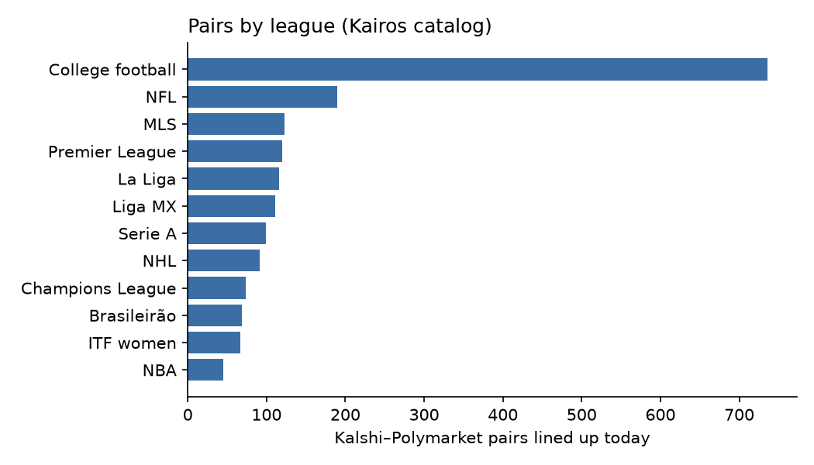

# Cross-venue report, 2026-10-07

Generated 2026-10-07 18:10 UTC from Kairos's matched-market catalog and Market Data API, and Kalshi's and Polymarket's public APIs.

## Pairs

Kairos listed 2,278 Kalshi–Polymarket pairs; 2,236 were lined up (98%), 19 of them with a warning such as a postponed game.

| Not lined up | Pairs |
|---|---|
| different dates | 34 |
| could not confirm both markets ask about the same team | 4 |
| Kalshi market is inactive | 3 |
| Kalshi market is finalized | 1 |

## Gaps today

| | Pairs |
|---|---|
| Quoted | 2,236 |
| Break P(A) = P(B) before fees | 32 |
| Edge after both venues' fees, top of the book | 5 |
| Edge left after walking the order books | 2 |

| Kalshi market (A) | Polymarket market (B) | Basket | Contracts | Net edge |
|---|---|---|---|---|
| Indiana wins | Pacers vs. Thunder | NO on A + YES on B | 6.32 | $0.0220 |
| Pittsburgh wins | Penguins vs. Blackhawks | YES on A + NO on B | 5.09 | $0.0125 |

Most gaps that show at the top of the book disappear after fees or in the order books.

## Gaps around game time

Games that started 6 to 30 hours ago: 252 of 282 pairs traded on both venues in the same minute, 6,814 minutes in all. The median gap between the two last trades was 1¢ and the 90th percentile 4¢; before the start the 90th percentile was 2¢.

| Widest gaps (at least 10 minutes compared) | Median | Largest | Minutes compared |
|---|---|---|---|
| M15 Sharm ElSheikh: Yurii Dzhavakian vs Bogdan Seleznev | 6¢ | 23¢ | 40 |
| W15 Maanshan: Alina Yuneva vs Yingqun Sun | 2¢ | 22¢ | 74 |
| M15 Pontevedra: Stefan Seifert vs Xavi Palomar | 1¢ | 21¢ | 26 |
| M15 Burgas: Cian Maguire vs Aleksa Ciric | 2¢ | 18¢ | 13 |
| M15+H Rodez: Alexandre Reco vs Romain Andres | 3¢ | 18¢ | 25 |

These are trade prices up to a minute apart, not quotes: a gap shows the venues disagreeing, not an arbitrage that could have been executed.

## Settlement

Games that started in the last seven days: 262 pairs have settled on both venues and 262 settled the same way (100%); 21 are still settling.

## Method

- Pairs come from Kairos `/matched-markets`; [oracle3-extras](https://github.com/YichengYang-Ethan/oracle3-extras) checks each one on both venues and decides which Polymarket outcome pays when Kalshi YES pays.
- Gaps today use each venue's published fee schedule (oracle3) and the live order books.
- Gaps around game time use Kairos one-minute candles; settlement uses Kairos `/v1/resolutions`.
- Only aggregates and a few example rows are published here.
